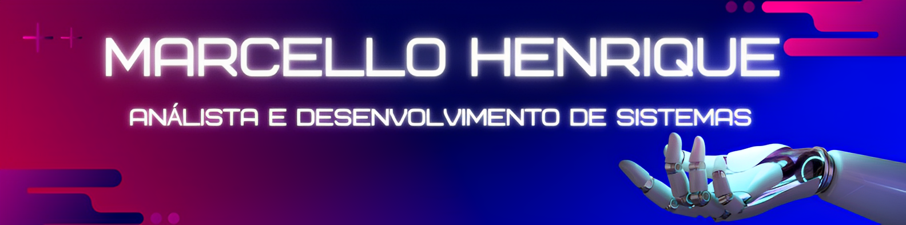

  

<h2 align="center">👋🏽 Olá, eu sou o Marcello Henrique!</h2>

<h2> 🧑🏻‍💻 Sobre mim</h2>

   <li>🎓 Graduado em Análise e Desenvolvimento de Sistemas – Senac</li>
    <li>🎓 Pós-graduado em Desenvolvimento de Sistemas com Python – Uniasselvi</li>
    <li>🎓 Pós-graduado em Gestão em Tecnologia – Uniasselvi</li>
  </ul>

<h2> 📌 Objetivo Profissional </h2>

 💻 Desenvolvedor em início de carreira, com foco em Backend, Frontend e Análise de Dados.
Sou apaixonado por tecnologia, desenvolvimento de sistemas e resolução de problemas, buscando minha primeira oportunidade para aplicar meus conhecimentos acadêmicos em projetos reais e evoluir profissionalmente na área de TI. 

<h2> 🚀 Tecnologias e Ferramentas</h2>
<ul>
  <li><strong>Linguagens:</strong> Python, Java, JavaScript</li>
  <li><strong>Backend:</strong> Spring Boot, Django, APIs REST</li>
  <li><strong>Frontend:</strong> HTML, CSS, JavaScript</li>
  <li><strong>Banco de Dados:</strong> MySQL, PostgreSQL, MongoDB</li>
  <li><strong>Outros:</strong> Git, GitHub, SQL</li>

<h2 align="left"> 📱 Meus Contatos </h2>

    
    
    

<h2> 📊 Sobre meu GitHub </h2>

 Aqui você encontrará projetos acadêmicos e práticos voltados para desenvolvimento de sistemas, APIs, banco de dados e análise de dados.
Meu objetivo é evoluir constantemente como desenvolvedor e construir soluções que gerem valor real.

