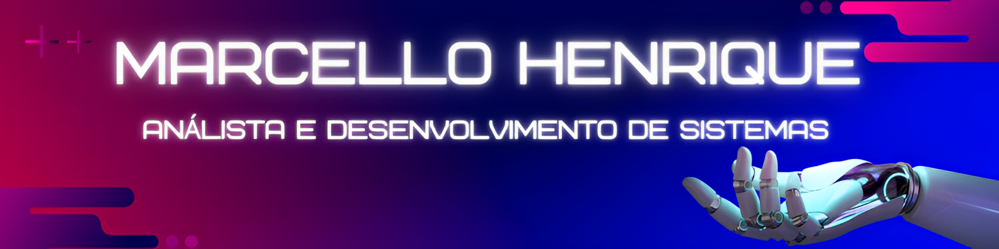

  

  
  

## Olá, eu sou o Marcello Abreu! Seja Bem Vindo no meu Repositório 👋🏽 </h2>

### Sobre mim

 -  Cursando Análise e Desenvolvimento de Sistemas - Senac SC

 -  Conhecimento Adquirido e Interesse de Vaga: Java, Python, Spring Boot, API, HTML, CSS, JavaScript, Django, BootStrap, VueJs, MySQL por enquanto... 

 -  Como estudante, estou buscando meu primeiro estágio na área da Tecnologia para complementar minha formação acadêmica e ganhar experiência no mercado de trabalho. 

 -  Estou muito animado para contribuir com minhas habilidades e aprender com profissionais experientes. 

## Minhas Habilidades em Programação 📝

    
    &nbsp;&nbsp;&nbsp;&nbsp;&nbsp;&nbsp;&nbsp;&nbsp;&nbsp;
    
    &nbsp;&nbsp;&nbsp;&nbsp;&nbsp;&nbsp;&nbsp;&nbsp;&nbsp;
    
    &nbsp;&nbsp;&nbsp;&nbsp;&nbsp;&nbsp;&nbsp;&nbsp;&nbsp;
    
    &nbsp;&nbsp;&nbsp;&nbsp;&nbsp;&nbsp;&nbsp;&nbsp;&nbsp;
    
    &nbsp;&nbsp;&nbsp;&nbsp;&nbsp;&nbsp;&nbsp;&nbsp;&nbsp;
    

## Meus contatos :iphone:

    
    
    
    

